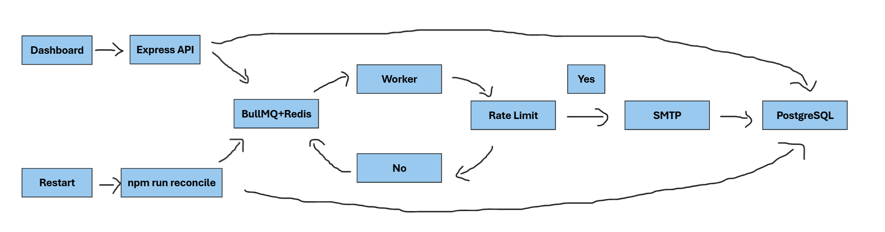

# Reach Scheduler

An email scheduling service built for a ReachInbox-style take-home. The API stores each send as a PostgreSQL row; BullMQ is the durable scheduling/dispatch layer. The dashboard uses real Google OAuth via NextAuth.

## Quick start

1. Copy `.env.example` to `.env`, then set Google OAuth credentials and Ethereal SMTP credentials. Add `http://localhost:3000/api/auth/callback/google` as the Google callback URL.
2. Start infrastructure: `docker compose up -d`.
3. Install packages: `npm install`.
4. Generate/migrate the database: `npm --workspace @reach/api run prisma:generate` then `npm --workspace @reach/api run prisma:migrate`.
5. In separate terminals run `npm run dev:api`, `npm run worker`, and `npm run dev:web`. Open `http://localhost:3000`.

Run `npm run reconcile` before each worker deployment/startup. A production process manager should execute that command and only then start the worker.

## Architecture and guarantees

`Next.js dashboard → Express API → PostgreSQL (source of truth) → BullMQ delayed job → worker → Ethereal SMTP`.

- A job is first persisted in Postgres, then queued with `jobId` exactly equal to the database row ID. BullMQ's uniqueness check makes repeated enqueue calls idempotent.
- CSV recipients are normalized/deduplicated client-side and persisted in one transaction. The API derives a spacing interval of `max(user delay, 1 hour / hourly limit)`, so campaigns are staggered and initially avoid hourly overflow.
- The worker has `WORKER_CONCURRENCY` (default 5). `MAX_EMAILS_PER_HOUR_PER_SENDER` (default 100) is the single enforced limit for each sender, even when that sender has multiple campaigns. `MIN_SEND_DELAY_MS` (default 1000) controls the inter-send gap. A Redis Lua script atomically checks/reserves both limits and remains correct with many worker replicas. If no slot is available, the active BullMQ job is moved back to delayed state at the next eligible timestamp; it is never discarded.
- Redis runs AOF (`appendonly yes`, `appendfsync everysec`) on a persistent Docker volume. The reconciliation command scans scheduled DB rows and re-adds only those whose queue job is missing. This covers queue loss/restart without duplicate scheduling.

### Delivery caveat

The database state transition prevents duplicate *queue processing*. No SMTP protocol can provide true exactly-once delivery around a process crash after an SMTP server accepts mail but before the database acknowledgement is committed. Production systems address that edge with a provider-side idempotency key/delivery API or an outbox provider. This implementation records each SMTP attempt and uses persistent queue/database recovery for all other restart paths.

## Demo video

The demo video with the explanation of project and the architecutre in a small 5 min. loom video: https://www.loom.com/share/ae2d02728ec94ff7b5ada8780939f64b.

## Production deployment notes

Use managed PostgreSQL and Redis with AOF/replication, run reconciliation as a release/startup hook, set the sender limit and `MIN_SEND_DELAY_MS` to provider policy, and expose the API behind authenticated server-side access rather than relying on the owner-email query parameter used by this take-home dashboard.
